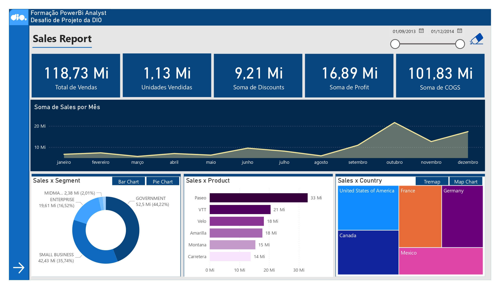
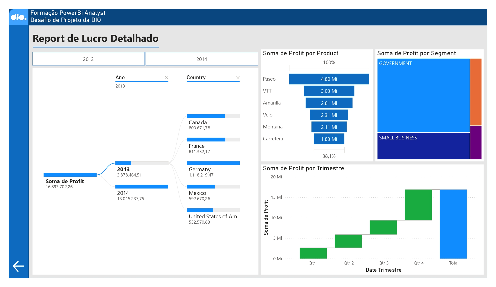

# powerbi_analyst3

# 📊 Dashboard de Vendas com Power BI

Projeto desenvolvido como continuação do bootcamp **Formação Power BI Analyst - DIO (Digital Innovation One)**.

O objetivo foi construir dashboards interativos e visualmente claros para análise de vendas, lucros e segmentos de mercado, aplicando boas práticas de visualização de dados e técnicas de modelagem no Power BI.

---

## 📁 Sobre o Projeto

Neste desafio, foi utilizado o conjunto de dados **Financials Sample**, fornecido pela própria **Microsoft**, como base para a criação do relatório no **Power BI Desktop**. A base contém informações simuladas de vendas globais entre 2013 e 2014.

O arquivo `.pbix` original do projeto está disponível neste repositório:

📂 **Dashboard_DIO_PowerBi.pbix**

---

## ✅ Visão Geral

O relatório final é composto por dois painéis principais:

1. **Sales Report**  
   Visão consolidada com indicadores de desempenho (KPIs) de vendas, lucros, descontos e COGS, além de comparativos por:
   - Mês
   - Produto
   - País
   - Segmento

2. **Report de Lucro Detalhado**  
   Análise do lucro detalhado por:
   - Ano
   - País
   - Produto
   - Segmento
   - Trimestre

---

## 🛠️ Técnicas e Recursos Utilizados

- Power BI Desktop
- ETL com Power Query (tratamento e transformação de dados)
- Modelagem de dados com relacionamentos entre tabelas
- Criação de **medidas DAX** e **colunas calculadas**
- Visualizações utilizadas:
  - Cartões de KPI
  - Gráfico de linhas
  - Gráficos de barras horizontais
  - Gráficos de pizza e donut
  - Treemap
  - Gráfico de barras empilhadas por trimestre
  - Diagrama hierárquico (tipo árvore)

---

## 🖼️ Screenshots

### 📌 Dashboard Principal

---

### 📌 Dashboard Detalhado

---
